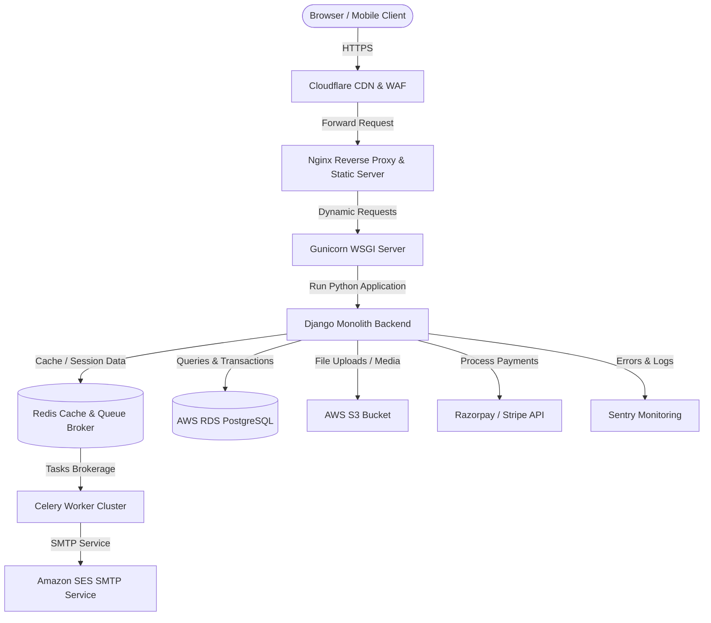
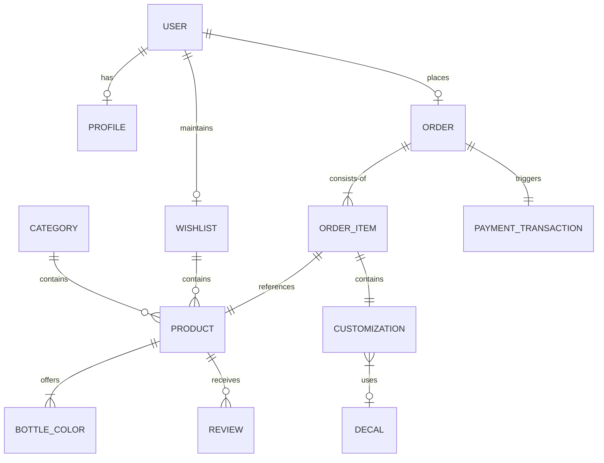
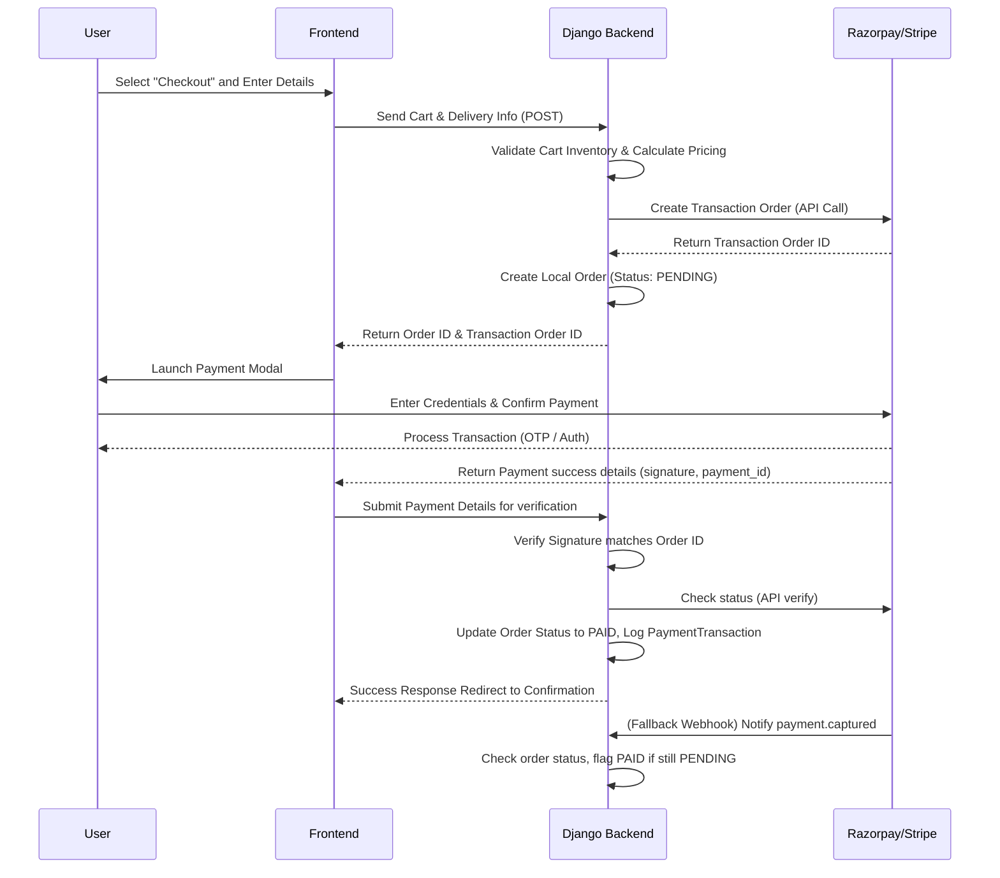
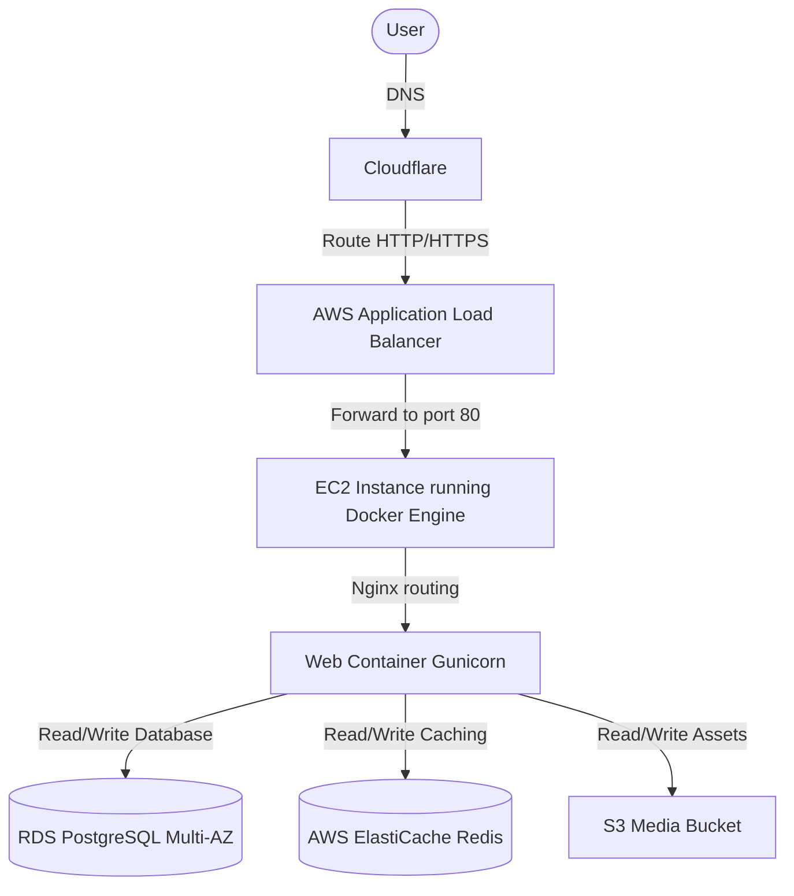
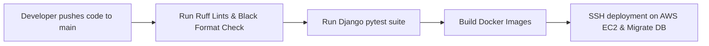

# Technical Architecture Document - Shake & Burp

This document details the high-level design, component breakdown, data schemas, deployment strategies, and security protocols for the **Shake & Burp** premium shaker bottle customizer and ecommerce application.

---

## 1. High-Level Architecture

The Shake & Burp architecture is built around a robust, scalable, containerized monolithic design using Django as the core application engine. High-performance caching, asynchronous processing, and cloud services handle intensive assets and transactions.



---

## 2. Request Flow

1. **Browser** initiates an HTTPS request to `https://shakeandburp.com`.
2. **Cloudflare** intercepts the request to check WAF rules, perform DDoS mitigation, and serve cached static assets/images from the edge.
3. **Nginx** acts as the primary web server on the AWS EC2 instance, serving static files directly and proxying dynamic requests to Gunicorn.
4. **Gunicorn** manages a pool of worker processes to hand off requests to Django's WSGI interface.
5. **Django** processes routing, authentication, middleware, executes view logic, and interacts with PostgreSQL and Redis.
6. **Redis** caches expensive query results and coordinates asynchronous Celery tasks.
7. **Celery Worker** runs background actions such as payment checks, transactional emails, and system updates.
8. **PostgreSQL** (AWS RDS) serves as the persistent system of record.
9. **AWS S3** stores custom user-uploaded artwork and base shaker bottle product photos.
10. **Amazon SES** dispatches transaction notifications and marketing emails.
11. **Razorpay/Stripe** handles secure payments and returns webhooks.
12. **Sentry** captures runtime exceptions and application performance bottlenecks.

---

## 3. Folder Structure

```
Shake&Burp/
├── .agent/                 # Custom IDE agent configurations & skills
├── md files/               # Pre-generation specification markdown assets
├── config/                 # Django settings and core project routing
│   ├── __init__.py
│   ├── asgi.py
│   ├── settings.py         # Modular environments settings file
│   ├── urls.py             # Main entry point URL configuration
│   └── wsgi.py
├── apps/                   # Pluggable Django applications directory
│   ├── accounts/           # User models, authentication, and profiles
│   ├── products/           # Shaker bottles, categories, and variations
│   ├── orders/             # Order templates, statuses, items, and billing
│   ├── payments/           # Razorpay and Stripe APIs integrations
│   ├── cart/               # Session-based and user-profile cart operations
│   ├── wishlist/           # Customer product wishlist management
│   ├── dashboard/          # Admin and customer dashboard views
│   ├── core/               # Site-wide layouts, helpers, and base view classes
│   └── api/                # REST endpoints for customizer utility queries
├── templates/              # Base HTML template directory (Tailwind classes)
│   ├── base.html
│   ├── partials/
│   ├── accounts/
│   ├── products/
│   ├── orders/
│   └── dashboard/
├── static/                 # Static CSS, JS libraries, and assets
│   ├── css/                # index.css (contains Tailwind utility imports)
│   ├── js/                 # customizer.js (canvas logic)
│   └── images/
├── media/                  # Local temporary storage for media uploads
├── docker/                 # Container configs (Dockerfiles, entrypoint scripts)
│   ├── django.Dockerfile
│   ├── nginx.conf
│   └── celery.Dockerfile
├── scripts/                # Database backups, migration helpers, deployments
│   ├── init_db.sh
│   └── deploy.sh
├── manage.py
├── requirements.txt
├── docker-compose.yml
└── README.md
```

---

## 4. Django App Structure

- **apps.accounts:** Custom User model inheriting from `AbstractUser`. Handles authentication (Google OAuth 2.0 & standard passwords), registration, profile details, and address updates.
- **apps.products:** Core product schemas: `Product`, `Category`, `ProductImage`, and `BaseBottleColor`. Stores sizes, colors, inventory, pricing, and references for print zones.
- **apps.orders:** Models `Order`, `OrderItem`, and `OrderLog`. Tracks delivery status, invoices, addresses, and individual customized prints.
- **apps.payments:** Interfaces payment checkouts, signature verification, hooks, and transaction audit trails (`PaymentTransaction`).
- **apps.cart:** Temporary state storage supporting both session-based anonymous carts and DB-synced authenticated carts.
- **apps.wishlist:** Tracks user product favorites.
- **apps.dashboard:** Custom view controllers for admin analytics, bulk CSV reports, order pipelines, content management, FAQs, and testimonials.
- **apps.core:** Houses shared utilities, custom template tags, common middleware, and error-handling view templates.
- **apps.api:** Houses API views serving base bottle data and decal image references to the clientside customization canvas.

---

## 5. Database Architecture



### Key Data Schemas & Relationships

#### Accounts & Profiles
- **User:** Extends standard user fields with unique phone number and Google unique ID.
- **Profile:** One-to-One with User. Stores billing and shipping addresses, avatar, and notification settings.

#### Products
- **Category:** Fields for title, slug, and hierarchical nesting.
- **Product:** Title, base description, basic pricing, active status, SKU, and weight.
- **BottleColor:** Foreign Key to Product. Links a specific color name, hex code, S3-image URL, and inventory level.
- **Decal:** Pre-designed decals for the customizer (title, SVG/PNG path, base price).

#### Customization
- **Customization:** Represents customized designs placed on a bottle order item:
  - `custom_image`: S3 path to custom artwork uploaded by the user.
  - `decal`: Foreign Key to pre-designed decal (optional).
  - `canvas_coordinates`: JSON field storing scaling parameters: `{x_offset: float, y_offset: float, scale_factor: float, rotation_degrees: float}`.

#### Orders & Payments
- **Order:** UUID key, reference to User, billing/shipping address text, overall status (`PENDING`, `PAID`, `SHIPPED`, `DELIVERED`, `CANCELLED`), order totals, tracking code.
- **OrderItem:** Foreign Key to Order and Product. Stores purchase price, quantity, and optional Foreign Key to `Customization`.
- **PaymentTransaction:** Foreign Key to Order. Records payment provider ID (Stripe/Razorpay), response JSON, verification hash, and status (`SUCCESS`, `FAILED`, `REFUNDED`).

---

## 6. API Architecture

The application exposes structured, JSON-returning endpoints to power the client-side customization visualizer:

- `GET /api/v1/products/<id>/colors/` - Fetches available colors, S3 mockups, and inventory for a specific shaker.
- `GET /api/v1/decals/` - Returns list of active pre-designed SVGs and PNG decals available to drag onto the canvas.
- `POST /api/v1/customizations/upload/` - Accepts user's transparent PNG/SVG custom files, writes them to S3, and returns a unique key.
- `POST /api/v1/cart/add-customized/` - Accepts customized configuration JSON and appends the custom item to the user's cart session.

---

## 7. Authentication Flow

1. **Email Authentication:** Standard secure login using Argon2/BCrypt password hashing over HTTPS, utilizing Django's native session-auth mechanism.
2. **Google OAuth 2.0 Flow:**
   - Client requests login -> Redirected to Google OAuth URL.
   - User grants permission -> Google redirects back with an authorization code.
   - Django backend exchanges the code for user metadata (email, first name, google ID).
   - If user doesn't exist, a new account is automatically provisioned; otherwise, the user is logged into their existing session.

---

## 8. Authorization

- **Permissions Middleware:** Enforces authentication and authorization at the view level.
- **User Roles:**
  - **Standard User:** Access to account dashboard, order history, wishlist, and profiles.
  - **Superuser / Staff User:** Access to the custom Admin Dashboard (/dashboard/admin/) and the Django default admin interface (/admin/).
- **Rule Enforcement:** Django's `PermissionRequiredMixin` is used exclusively. CSRF verification is strictly enforced on all unsafe operations (POST, PUT, DELETE).

---

## 9. Payment Flow



---

## 10. Docker Architecture

The setup utilizes multi-stage Dockerfiles to minimize final image sizes and secure runtime environments.

- **Stage 1 (Build):** Installs compiler dependencies, prepares pip wheels, and aggregates static assets.
- **Stage 2 (Runtime):** Copy wheels and static files. Runs a minimal Alpine/Debian slim system, mapping application processes to a non-privileged `django` system user.

```yaml
version: '3.8'

services:
  web:
    build:
      context: .
      dockerfile: docker/django.Dockerfile
    command: gunicorn config.wsgi:application --bind 0.0.0.0:8000 --workers 3
    volumes:
      - static_volume:/app/staticfiles
      - media_volume:/app/media
    env_file:
      - .env
    depends_on:
      - db
      - redis

  celery:
    build:
      context: .
      dockerfile: docker/celery.Dockerfile
    command: celery -A config worker --loglevel=info
    env_file:
      - .env
    depends_on:
      - redis
      - db

  db:
    image: postgres:15-alpine
    volumes:
      - postgres_data:/var/lib/postgresql/data
    env_file:
      - .env

  redis:
    image: redis:7-alpine
    volumes:
      - redis_data:/data

  nginx:
    image: nginx:stable-alpine
    volumes:
      - ./docker/nginx.conf:/etc/nginx/nginx.conf:ro
      - static_volume:/app/staticfiles:ro
      - media_volume:/app/media:ro
    ports:
      - "80:80"
      - "443:443"
    depends_on:
      - web

volumes:
  postgres_data:
  redis_data:
  static_volume:
  media_volume:
```

---

## 11. AWS Deployment



- **EC2 Instance:** Hosts the Docker Compose stack containing Gunicorn, Celery, and Nginx.
- **RDS PostgreSQL:** Fully managed database running in a private subnet, utilizing Multi-AZ replication.
- **Amazon S3:** Stores user design assets, decal catalog assets, and database backups.
- **Amazon SES:** Dedicated SMTP service configured with DKIM/SPF to send transaction emails.
- **Elasticache (Redis):** Handles application cache and Celery broker services (optional scaling path; default configuration uses local Dockerized Redis instance).
- **GitHub Actions Pipeline:** Automatically triggers on `main` merge to build docker layers, push to Amazon ECR, and execute a rolling update script on EC2.

---

## 12. Security Architecture

- **HTTPS Configuration:** Enforced strictly via Cloudflare and Nginx. HSTS headers enabled.
- **Database Access Rules:** RDS is restricted to accept traffic exclusively from the EC2 instance's Security Group on port 5432.
- **Environment Isolation:** Credentials and API keys (Stripe secrets, Database logins) are injected at runtime via environment variables; no hardcoded secrets exist in version control.
- **File Validation:** User design uploads are scanned by python-magic for mime-types, size limits are enforced (< 5MB), and files are renamed to UUIDs prior to S3 upload.

---

## 13. Logging

The application implements a centralized Django logger config routing logs to output streams (`stdout`) inside Docker:

- **Format:** Structured text formatting: `[TIMESTAMP] [LEVEL] [LOGGER_NAME] [MESSAGE]`.
- **Sentry Integration:** All warning and error logs are automatically forwarded to Sentry with the request stack trace and user context information.

---

## 14. Monitoring

- **Sentry Error Tracking:** Monitors real-time runtime exceptions, SQL latency, and transaction performance metrics.
- **Nginx Access Logs:** Monitored on EC2 to analyze response code distributions, traffic sources, and response latencies.
- **AWS CloudWatch Alerts:** Configured to monitor EC2 CPU utilization (>80%), free database storage threshold limits, and S3 upload request counts.

---

## 15. Scaling Strategy

- **Horizontal Scalability:** App container logic is stateless; sessions are stored in the database or Redis cache.
- **Database Partitioning:** Read-heavy database requests are mitigated using Redis cache keys for static items like bottle styles, decal lists, FAQs, and testimonials.
- **Workers Scale:** Celery processes can be scaled out into separate EC2 instances if print processing or custom design conversion workloads spike.

---

## 16. Backup Strategy

- **Automated Database Backups:** AWS RDS automated daily snapshots retained for 30 days.
- **Transaction Logs:** Enabled point-in-time recovery options in RDS.
- **S3 Bucket Replication:** Media bucket replicated daily to a secondary AWS region for geographic disaster recovery.

---

## 17. Disaster Recovery

- **Recovery Point Objective (RPO):** Maximum of 24 hours (based on daily snapshots).
- **Recovery Time Objective (RTO):** Maximum of 2 hours.
- **Failover Routine:** Infrastructure is scripted via Docker Compose and Terraform; in case of EC2 failure, a new instance can be provisioned and configured immediately via GitHub Actions deployment.

---

## 18. CDN Strategy

- **Edge Caching:** All static CSS, JavaScript, fonts, and base shaker bottle photos are cached in Cloudflare CDN with an edge TTL of 30 days.
- **Bypass Rule:** Checkout, carts, customizer canvas updates, and admin dashboard routes bypass CDN caching to prevent serving stale state.

---

## 19. Caching Strategy

- **Cache Provider:** Django Redis cache backend.
- **Cached Objects:**
  - Decal library database listings (TTL: 24 hours).
  - Average bottle reviews and product details (TTL: 1 hour, invalidated on new review submission).
  - FAQ list and blog articles (TTL: 7 days, invalidated on admin dashboard update).

---

## 20. CI/CD Pipeline



1. **Trigger:** Developer pushes a commit to the `main` branch.
2. **Lint & Test:** GitHub Actions Runner executes Ruff style checks, Black formatting validation, and runs the Django pytest suite (unit and integration tests).
3. **Containerization:** Builds application images and tags them with the git commit SHA.
4. **Deploy:** Runner establishes an SSH connection to the target EC2 instance, updates the environment configuration, pulls the new images, executes Django database migrations (`python manage.py migrate`), collects static assets, and restarts Gunicorn/Celery container instances with zero-downtime.
