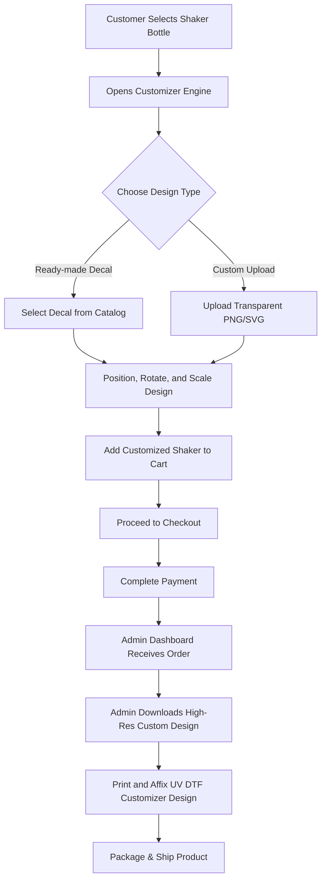
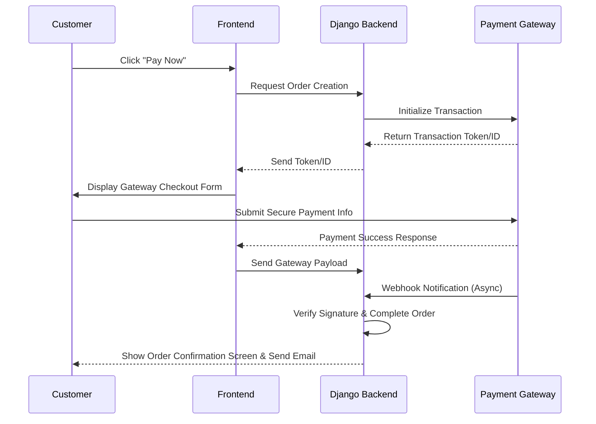
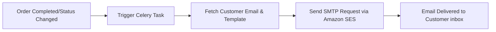

# Product Requirements Document (PRD) - Shake & Burp

## Executive Summary
Shake & Burp is a premium, high-end ecommerce platform tailored for the modern fitness enthusiast, athlete, and corporate client. The platform allows users to purchase elite-grade shaker bottles and customize them using high-durability UV DTF (Direct to Film) designs. By providing real-time, high-fidelity design previews, ready-made artistic designs, custom artwork upload capabilities, and bulk ordering facilities, Shake & Burp aims to redefine fitness lifestyle gear with a cinematic, premium shopping experience.

---

## Product Vision
To elevate fitness accessories from basic commodities to personalized, premium luxury statements. We combine cutting-edge custom printing technology with a modern, cold, luxury aesthetic to deliver an unmatched, high-performance shopping experience.

---

## Goals
- Provide an immersive, visually stunning customizer tool for customers to personalize premium shaker bottles.
- Deliver a robust ecommerce engine supporting secure single-item and bulk B2B purchases.
- Maintain a fast, reliable admin dashboard for seamless order execution, customization verification, and content management.
- Ensure high performance (Lighthouse score > 95) and seamless mobile responsiveness.

## Non-goals
- Developing a dedicated mobile app (iOS/Android native) in the initial release (focus is strictly responsive mobile web).
- Managing in-house delivery services (3rd-party logistics APIs will be used).
- Creating a social media platform or in-app messaging system between customers.

---

## User Personas
1. **Gym Enthusiast (Ethan, 24):** Wants a high-quality shaker bottle that matches his active lifestyle and aesthetic, with a unique graphic that won't scratch or fade during rough use.
2. **Fitness Influencer (Sophia, 28):** Seeks highly customized, branded bottles with custom logos/artwork for video placement, branding, and promotional giveaways.
3. **Corporate Gifting Buyer (David, 42):** Needs a seamless flow to upload corporate logos, request bulk custom printing orders, and receive bulk discounts for company events.
4. **Retail Customer (Emma, 30):** Looks for premium ready-made artistic bottles as high-quality gifts for active friends and family.

---

## User Stories
- **As a customer**, I want to browse high-quality photos of premium shaker bottles so that I can choose the right base color and size.
- **As a creative customer**, I want to use a design customizer to place pre-designed decals or upload my own transparent artwork on a 2D/3D representation of the bottle so that I can visualize the final product.
- **As a bulk customer**, I want to request a custom bulk printing quote and upload vector files so that our team can get branded merchandise.
- **As a returning customer**, I want to save favorite bottles to my wishlist and easily re-order my previous custom designs.
- **As an admin**, I want to view order customization details and download high-resolution source print files so that the manufacturing team can print the designs accurately.

---

## Functional Requirements

### 1. Customer Features

#### A. Catalog & Browsing
- **Product Grid:** Premium layout displaying shaker bottles with hover-based image swaps, pricing, average reviews, and badges (e.g., "Limited Edition", "Best Seller").
- **Product Detail Page (PDP):** Comprehensive specs, material details (BPA-free, double-walled insulation), color/size selection, and high-fidelity product gallery.
- **Reviews & Ratings:** Authenticated customers can rate purchased bottles (1-5 stars) and write text reviews with photo attachments.
- **Wishlist:** Quick "favorite" toggle (heart icon) to save products to a personal wishlist.

#### B. Customization Engine (UV DTF Customizer)
- **Interactive Visualizer:** A dark-themed preview canvas where users select a shaker bottle color/size and overlay:
  - **Ready-Made Designs:** High-durability UV DTF decals pre-curated by the platform.
  - **Custom Artwork Uploads:** PNG/SVG file upload with transparent backgrounds.
- **Canvas Controls:** Drag, scale, rotate, and align artwork within the safe printable zone of the shaker bottle.
- **Real-time Preview:** Visual simulation of how the print looks on the metal/plastic body of the shaker.

#### C. Shopping Cart & Checkout
- **Cart Management:** Slide-out drawer displaying item details, base bottle price, customization surcharge, and aggregate total.
- **Checkout Flow:** Optimized single-page checkout collecting shipping details and integrating Razorpay/Stripe securely.
- **Coupon System:** Support for discount code application with instant recalculation of cart totals.

#### D. Account & Profiles
- **Authentication:** Dual login systems via standard Email/Password (with secure password reset) and Google OAuth 2.0.
- **Order History:** Details of past orders, order status, shipment tracking links, and digital invoice downloads.
- **Address Book:** Manage default billing and shipping addresses.

---

### 2. Admin Dashboard Features

#### A. Catalog & Inventory Management
- **Product & Category CRUD:** Manage base shaker bottles, sizes, and colors.
- **UV DTF Decal Library:** Upload and categorize ready-made patterns and designs available in the customizer.
- **Inventory Tracking:** Real-time stock levels, low-stock warnings, and restock logs.

#### B. Order & Customization Processing
- **Order Pipeline:** View pending, processing, shipped, and completed orders.
- **Print-File Downloader:** Access and download raw, high-resolution custom artwork uploaded by users (original PNG/SVG/PDF files) alongside size and position coordinates for print alignment.
- **Shipping Integration:** Update tracking numbers, generate shipping labels, and dispatch notifications.

#### C. Marketing & Content Management
- **Discounts & Coupons:** Set up percentage-based, fixed-amount, or free-shipping promo codes with active date ranges.
- **Homepage Banner Management:** Update hero carousel slides, promotions, and featured collections.
- **FAQs, Testimonials & Blogs:** Complete CRUD management for static content, customer stories, and articles.

#### D. Analytics & Support
- **Sales Analytics:** Visual reports of daily revenue, units sold, custom vs. ready-made sales, and average order value.
- **Support System:** Manage client inquiries, bulk custom order requests, and customer contact forms.

---

## Non-Functional Requirements

### 1. Security Requirements
- **Data Protection:** SSL/TLS encryption for all traffic. Hashed passwords using Argon2id/BCrypt.
- **Payment Security:** Full PCI-DSS compliance via Stripe tokenization and Razorpay signatures. Never store raw card details.
- **CSRF & XSS Protection:** Django standard middleware enabled. Strict Content Security Policy (CSP) headers.
- **Rate Limiting:** Protect API endpoints, login routes, and customization upload endpoints from DDoS and brute force.

### 2. Performance Targets
- **Page Load Speed:** Largest Contentful Paint (LCP) under 1.5 seconds.
- **Lighthouse Performance:** Target score of 95+ across all core product pages.
- **Responsive Experience:** High frame rate (60fps) animations for transitions, loading skeletons, and interactive customizer states.

### 3. SEO & Accessibility Requirements
- **SEO Best Practices:** Semantic HTML5 elements, automated meta tags (OpenGraph, Twitter cards), dynamic sitemap.xml, and clean canonical URLs.
- **Accessibility:** WCAG 2.1 AA compliance. Proper ARIA attributes, keyboard navigation (focus states visible), and color contrast ratio > 4.5:1. Responsive design must adapt cleanly without losing functionality.

---

## Workflow Definitions

### 1. Customization and Order Workflow

### 2. Payment Workflow

### 3. Notification Workflow

---

## Success Metrics
- **Conversion Rate:** Target > 2.5% for unique customized bottle orders.
- **Customer Satisfaction:** Review rating average > 4.5/5.0.
- **System Uptime:** 99.99% availability using AWS multi-AZ RDS and auto-scaled EC2.
- **Lighthouse Performance Score:** Consistent score of 95+.

---

## Risks, Assumptions & Dependencies
- **Risks:** High resolution image uploads by customers can strain S3 bandwidth and slow down visualizer loading.
  - *Mitigation:* Clientside compression/resizing before uploads.
- **Assumptions:** Customers will supply transparent high-quality files.
  - *Mitigation:* Form validation checks file resolution and formats; admin has option to reject bad-quality files.
- **Dependencies:** Uninterrupted API services for payment providers (Razorpay/Stripe) and mail delivery (Amazon SES).

---

## Acceptance Criteria
- Customers must be able to complete custom bottle orders in less than 5 steps from selection.
- All customer design coordinate transformations (X, Y offset, scale, rotation) must save to the database and reproduce accurately in the admin print-viewer.
- Admin dashboard must download print-ready files in the native uploaded dimensions.
